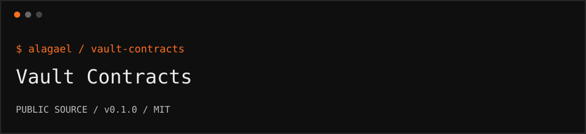

<p></p>

# Vault Contracts

Permissionless per-vault Ethereum inheritance contracts, based on an immutable factory and a Safe-compatible dead man's switch.

```text
repository   github.com/alagael/vault-contracts
release      0.1.0 / public beta
audit        not independently audited
support      support@alagael.xyz
```

## What ships

- `DeadManSwitch.sol`: a Safe-compatible inheritance module and transaction guard.
- `DeadManSwitchFactory.sol`: an immutable implementation reference and permissionless ERC-1167 clone creation.
- MockSafe regression tests, exported ABIs, and public mainnet deployment references.

No hosted application, operator keys, deployment credentials, or wallet data are included.

## Build and test

```sh
git clone https://github.com/alagael/vault-contracts.git
cd vault-contracts
pnpm install --frozen-lockfile
pnpm run build
pnpm test
pnpm pack
```

Requirements: Node.js 22+, pnpm 10.17.1, Foundry v1.1.0. Solidity 0.8.30 is pinned in foundry.toml. The generated ABIs appear in `abi/`.

## Ethereum mainnet

| Component | Address |
| --- | --- |
| Factory | `0xe1906bBFf0c6AE8139b84c713CA60306596FD80f` |
| Implementation | `0xe821e8E3DE2bA2691437bE5EB69AF0Cd14f3afB9` |

[Factory on Etherscan](https://etherscan.io/address/0xe1906bBFf0c6AE8139b84c713CA60306596FD80f) · [Implementation on Etherscan](https://etherscan.io/address/0xe821e8E3DE2bA2691437bE5EB69AF0Cd14f3afB9)

## Ownership and activation

1. A user-controlled Safe holds the assets.
2. `factory.create(safe, heir, delaySeconds)` creates a separate switch instance with its own state. It does not create the Safe itself.
3. The Safe owner must enable that instance as a module, install it as guard, and initialize the activity countdown. A factory creation event alone does not prove activation.
4. A check-in resets the inactivity countdown. While configured as guard, ordinary Safe transactions also update activity.
5. After the delay expires, the designated heir can submit `triggerTakeover()`. This changes Safe control; it does not automatically transfer every asset when the timer expires.

The factory is permissionless and does not custody funds or gain owner rights over a Safe. A shared implementation is shared code, not shared user state. A clone targeting someone else's Safe is not authorized unless that Safe enables it.

**Deposit only into your own verified Safe address. Never deposit into the factory, implementation, or switch module.**

## Limits

This is public beta and not independently audited. The shipped unit tests use MockSafe; they are not an independent review or comprehensive real-Safe integration proof. Contract settings, transactions, and balances are public. Verify chain, bytecode, owners, enabled modules, guard, heir, and delay before depositing. A compromised owner wallet or enabled module remains a risk.

## Releases and contributing

GitHub releases contain reviewed source packages and checksums. `pnpm pack` creates an installable archive; no npm-registry availability is assumed. See [RELEASING](RELEASING.md), [CONTRIBUTING](CONTRIBUTING.md), and [SECURITY](SECURITY.md).

MIT for these contracts; bundled test tooling retains its notices in [THIRD_PARTY_NOTICES](THIRD_PARTY_NOTICES.md).
